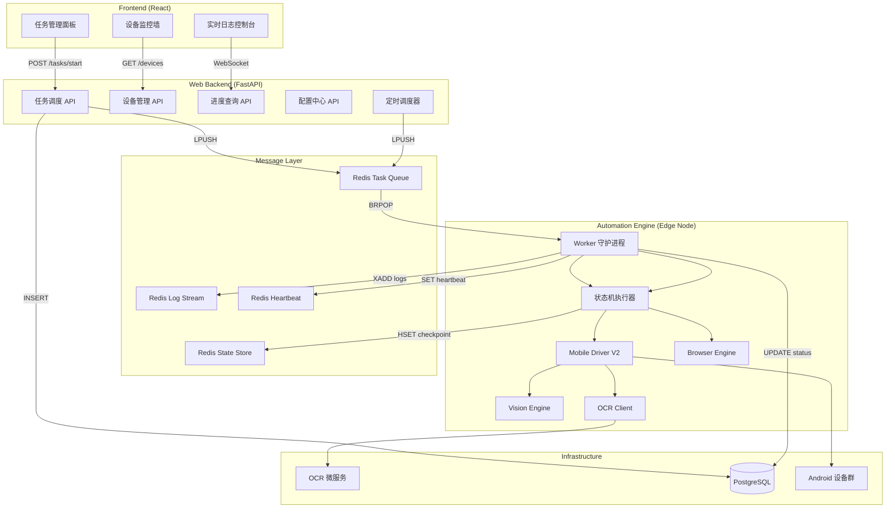

# Automation Engine 生产级改造规格书

> 版本: v1.0 | 日期: 2025-05-22
> 基于对 `automation_engine/` 全部 17 个源文件的逐行审计

---

## 1. 系统全景架构



---

## 2. 现状审计与差距总表

| # | 维度 | 当前状态 | 目标状态 | 等级 |
|---|------|---------|---------|------|
| 1 | 配置管理 | 硬编码散落在 6 个文件 | `pydantic-settings` + `config.yaml` 统一加载 | 🔴 |
| 2 | 进程模型 | CLI 单次运行 / 死循环 | Redis 消费者守护进程 + 信号处理 | 🔴 |
| 3 | 通信协议 | 零集成（脚本与后端无交互） | Redis Queue 双向通信 | 🔴 |
| 4 | 状态持久化 | 内存变量（49 行状态机） | Redis Hash checkpoint + 断点续跑 | 🔴 |
| 5 | 凭证安全 | API Key 明文写在源码中 | 后端加密存储，运行时注入 | 🔴 |
| 6 | 设备资源池 | 无注册 / 无心跳 / 无路由 | DB 注册 + Redis 心跳 + 定向路由 | 🟡 |
| 7 | 日志可观测 | `stdout` JSON + `print()` | Redis Stream + WebSocket + 截屏留证 | 🟡 |
| 8 | 错误处理 | 粗粒度 `except Exception` | 分级重试 + 指数退避 + DLQ + 告警 | 🟡 |
| 9 | 测试覆盖 | 零 | 核心模块单元测试 + Mock 集成测试 | 🟡 |
| 10 | OCR 服务 | 51 行单实例无保护 | 健康检查 + 熔断器 + 负载均衡 | 🟡 |
| 11 | 浏览器引擎 | 400 行过程式 + 全局变量 | 类封装 + 会话管理 + 类型声明 | 🟡 |
| 12 | 风控配额 | 部分实现（漏斗 + IP 轮换） | 全局配额管理器 + 动态仿生参数 | 🟢 |

---

## 3. 模块设计规格

### 3.1 配置中心 (`automation_engine/config.py`)

**问题源文件**：
- `start_browser_automation.py` L9-37: `DRY_RUN`, `OPENAI_API_KEY`, `TEMPLATES` 硬编码
- `start_single_run.py` L12-13: `DRY_RUN`, `SEARCH_KEYWORD` 硬编码
- `mobile_core/ocr_client.py` L11: OCR 端点硬编码
- `mobile_core/agentless_driver.py` L75-76: 坐标硬编码

**目标设计**：

```python
# automation_engine/config.py
from pydantic_settings import BaseSettings

class EngineSettings(BaseSettings):
    # Redis
    redis_url: str = "redis://localhost:6379/0"
    task_queue_name: str = "automation_tasks"

    # OCR
    ocr_endpoints: list[str] = ["http://localhost:8001/ocr"]
    ocr_timeout: int = 60
    ocr_circuit_breaker_threshold: int = 3

    # Device
    default_device_serial: str | None = None
    screen_width: int = 1080
    screen_height: int = 1920

    # Risk Control
    comment_cooldown_seconds: int = 90
    max_daily_comments: int = 10
    max_daily_likes: int = 30
    farming_steps: int = 50

    # Vision
    template_match_threshold: float = 0.75
    templates_dir: str = "./data/ui_templates"

    class Config:
        env_prefix = "AE_"
        env_file = ".env"
```

**加载优先级**：环境变量 > `.env` 文件 > `config.yaml` > 默认值
**热更新**：Worker 监听 Redis channel `config_updates`，收到信号后重新加载。

---

### 3.2 Worker 守护进程 (`automation_engine/worker.py`)

**核心职责**：从 Redis 拉取任务 → 路由到执行函数 → 回报状态

```python
# automation_engine/worker.py (设计伪代码)
import signal, json, redis
from config import EngineSettings
from task_router import TaskRouter

class AutomationWorker:
    def __init__(self):
        self.settings = EngineSettings()
        self.redis = redis.Redis.from_url(self.settings.redis_url)
        self.router = TaskRouter(self.settings)
        self.running = True
        signal.signal(signal.SIGTERM, self._shutdown)
        signal.signal(signal.SIGINT, self._shutdown)

    def _shutdown(self, signum, frame):
        self.running = False

    def run(self):
        self._register_devices()
        self._start_heartbeat_thread()
        self._recover_incomplete_tasks()

        while self.running:
            result = self.redis.brpop(self.settings.task_queue_name, timeout=5)
            if result is None:
                continue
            _, raw = result
            job = json.loads(raw)
            self._execute_job(job)

    def _execute_job(self, job: dict):
        task_id = job["task_id"]
        try:
            self._update_status(task_id, "running", progress=0)
            result = self.router.dispatch(job)
            self._update_status(task_id, "completed", progress=100, result=result)
        except FatalError as e:
            self._update_status(task_id, "failed", error=str(e))
            self._send_alert(task_id, e)
        except RetryableError as e:
            self._enqueue_retry(job, e)

    def _recover_incomplete_tasks(self):
        """启动时检查 Redis 中是否有未完成的 checkpoint，恢复执行"""
        ...

    def _register_devices(self):
        """通过 adb devices 发现设备并注册到 DB"""
        ...

    def _start_heartbeat_thread(self):
        """后台线程每 10 秒上报设备状态到 Redis"""
        ...
```

**任务路由表** (`task_router.py`)：

| `driver_type` | 执行函数 | 说明 |
|---------------|---------|------|
| `device_init` | `tools.optimize_device.run()` + `tools.auto_crop_templates.run()` | 设备初始化 |
| `mobile_v2` | `XHSBusinessFlows.run_*()` | 移动端自动化 |
| `browser` | `BrowserAutomationEngine.run()` | 浏览器自动化 |
| `farm` | `XHSBusinessFlows.run_farm()` | 养号模式 |

---

### 3.3 状态机持久化 (`mobile_core/state_machine.py` 改造)

**当前代码**：49 行，纯内存，崩溃即丢失。

**改造设计**：

```python
class PersistentStateMachine:
    def __init__(self, driver, watchdog, redis_client, task_id):
        self.redis = redis_client
        self.task_id = task_id
        self.checkpoint_key = f"task:{task_id}:checkpoint"

    def execute(self, start_state_func, *args, **kwargs):
        # 1. 检查是否有断点
        saved = self.redis.hgetall(self.checkpoint_key)
        if saved:
            state_name = saved[b"state"].decode()
            step_data = json.loads(saved.get(b"data", b"{}"))
            next_state = self._resolve_state(state_name)
            args = step_data.get("args", args)
        else:
            next_state = start_state_func

        # 2. 执行状态流转
        while next_state:
            self._save_checkpoint(next_state.__name__, args, kwargs)
            try:
                next_state = next_state(*args, **kwargs)
            except RiskControlTriggered:
                self._save_checkpoint("SUSPENDED", args, kwargs)
                raise
            except PopupIntercepted:
                continue  # 重试当前状态

        # 3. 清理 checkpoint
        self.redis.delete(self.checkpoint_key)

    def _save_checkpoint(self, state_name, args, kwargs):
        self.redis.hset(self.checkpoint_key, mapping={
            "state": state_name,
            "data": json.dumps({"args": list(args)}),
            "updated_at": datetime.utcnow().isoformat()
        })
```

---

### 3.4 设备资源池

**数据库表设计** (`devices`)：

| 字段 | 类型 | 说明 |
|------|------|------|
| id | SERIAL PK | 自增主键 |
| serial | VARCHAR(64) UNIQUE | ADB Serial / IP |
| alias | VARCHAR(128) | 人类可读名称 |
| status | ENUM | `idle` / `busy` / `initializing` / `offline` / `suspended` |
| current_task_id | INT FK | 当前正在执行的任务 |
| bound_account_id | INT FK | 绑定的小红书账号 |
| device_info | JSONB | 型号、分辨率、Android 版本 |
| last_heartbeat | TIMESTAMP | 最后心跳时间 |

**心跳机制**：
```
Worker 后台线程 → 每 10 秒 → Redis SET device:{serial}:hb {timestamp} EX 30
Backend 定时器 → 每 30 秒 → 扫描过期的心跳 → 将设备标记为 offline
```

**定向路由**：任务消息体携带 `target_device_serial`，Worker 取到任务后校验是否为本机设备。

---

### 3.5 Backend API 规格

#### 3.5.1 任务调度

| 方法 | 路径 | 说明 |
|------|------|------|
| POST | `/api/automation/tasks` | 创建任务（异步入队） |
| GET | `/api/automation/tasks/{id}` | 查询任务状态与进度 |
| GET | `/api/automation/tasks/{id}/logs` | 拉取任务日志 |
| POST | `/api/automation/tasks/{id}/cancel` | 取消任务 |
| GET | `/api/automation/tasks` | 任务列表（分页+筛选） |

**创建任务请求体**：
```json
{
    "driver_type": "mobile_v2",
    "action": "reply",
    "device_serial": "emulator-5554",
    "config": {
        "keyword": "旅游攻略",
        "live_mode": false,
        "typing_mode": "opencv"
    }
}
```

**任务状态响应体**：
```json
{
    "task_id": 42,
    "status": "running",
    "progress": 65,
    "current_state": "state_post_reply",
    "device_serial": "emulator-5554",
    "started_at": "2025-05-22T07:30:00Z",
    "logs_count": 128,
    "last_screenshot_url": "/api/automation/tasks/42/screenshot"
}
```

#### 3.5.2 设备管理

| 方法 | 路径 | 说明 |
|------|------|------|
| GET | `/api/automation/devices` | 设备列表（含心跳状态） |
| POST | `/api/automation/devices/{serial}/init` | 触发设备初始化 |
| POST | `/api/automation/devices/{serial}/bind` | 绑定账号到设备 |
| POST | `/api/automation/devices/{serial}/rotate-ip` | 触发 IP 轮换 |

#### 3.5.3 配置管理

| 方法 | 路径 | 说明 |
|------|------|------|
| GET | `/api/automation/config` | 获取当前引擎配置 |
| PATCH | `/api/automation/config` | 更新配置（触发热更新） |

#### 3.5.4 风控配额

| 方法 | 路径 | 说明 |
|------|------|------|
| GET | `/api/automation/quotas/{account_id}` | 查询账号今日剩余配额 |
| POST | `/api/automation/quotas/{account_id}/acquire` | Worker 申请配额 |

---

### 3.6 日志与可观测性

**日志流架构**：

```
Worker logger.info("Typing text")
    ↓
JSONFormatter (添加 task_id, device_id, timestamp)
    ↓
RedisStreamHandler → XADD task:{id}:logs * level INFO msg "Typing text"
    ↓
Backend WebSocket endpoint → 读取 XREAD → 推送到前端
    ↓
Frontend 黑色终端控制台实时渲染
```

**异常截屏**：
```python
# 在 state_machine.py 的 except 块中
except Exception as e:
    screenshot = self.driver.screenshot()
    _, buf = cv2.imencode('.jpg', screenshot, [cv2.IMWRITE_JPEG_QUALITY, 50])
    b64 = base64.b64encode(buf).decode()
    logger.error("State failed", extra={
        "task_id": self.task_id,
        "screenshot_b64": b64,
        "state": current_state_name
    })
```

---

### 3.7 错误处理与重试策略

**异常分级体系**：

```python
# mobile_core/exceptions.py (扩展)
class RetryableError(MobileDriverException):
    """网络超时、OCR 暂时不可用 → 指数退避重试"""
    pass

class FatalError(MobileDriverException):
    """风控触发、设备断连 → 立即停止 + 告警"""
    pass

class TransientError(MobileDriverException):
    """弹窗拦截 → 自动处理后重试当前步骤"""
    pass
```

**重试策略**：

| 异常类型 | 重试次数 | 退避策略 | 失败后处理 |
|---------|---------|---------|-----------|
| `RetryableError` | 3 | 指数退避 (30s, 60s, 120s) | 推入 DLQ |
| `FatalError` | 0 | — | 立即停止 + 飞书告警 |
| `TransientError` | 5 | 固定 2s | 标记设备异常 |

**死信队列 (DLQ)**：
- 队列名: `automation_tasks_dlq`
- 消息体增加 `retry_count` 和 `last_error` 字段
- Backend 提供 `/api/automation/dlq` 查看和手动重新入队

---

### 3.8 OCR 服务增强

**当前**：51 行，无健康检查、无限流、无认证。

**改造项**：

```python
# start_ocr_server.py 增强
@app.get("/health")
async def health():
    return {"status": "ok", "engine": "PaddleOCR", "uptime": time.time() - START_TIME}

@app.post("/ocr")
async def process_ocr(request: ImageRequest):
    if len(request.image_base64) > 10 * 1024 * 1024:  # 10MB 限制
        raise HTTPException(413, "Image too large")
    ...
```

**客户端熔断器** (`OCRClient` 改造)：
```python
class OCRClient:
    def __init__(self, endpoints: list[str]):
        self.endpoints = endpoints
        self.failure_counts = {ep: 0 for ep in endpoints}
        self.circuit_open_until = {ep: 0 for ep in endpoints}

    def ocr_image(self, image_np):
        for ep in self.endpoints:
            if time.time() < self.circuit_open_until[ep]:
                continue  # 熔断中，跳过
            try:
                result = self._call(ep, image_np)
                self.failure_counts[ep] = 0
                return result
            except Exception:
                self.failure_counts[ep] += 1
                if self.failure_counts[ep] >= 3:
                    self.circuit_open_until[ep] = time.time() + 60
        raise OCRServiceError("All OCR endpoints unavailable")
```

---

## 4. 安全规范

| 项目 | 当前 | 改造 |
|------|------|------|
| OpenAI API Key | 源码明文 L11 | Backend `ModelConfig.encrypted_api_key`，任务下发时解密注入 |
| OCR 服务 | 无认证 | Bearer Token 认证 |
| Redis | 无密码 | 配置 `requirepass` + TLS |
| 设备 ADB | 无限制 | 仅监听 `127.0.0.1`，禁止远程 ADB |

**凭证注入流**：
```
Backend 数据库 (加密存储)
    → 任务下发时解密
    → 写入 Redis 任务消息体
    → Worker 读取后注入运行时 context
    → 任务结束后从内存清除
    → 绝不落盘
```

---

## 5. 目录结构（改造后）

```
automation_engine/
├── config.py                    # 🆕 统一配置 (pydantic-settings)
├── config.yaml                  # 🆕 默认配置文件
├── worker.py                    # 🆕 守护进程入口
├── task_router.py               # 🆕 任务路由分发
├── mobile_core/
│   ├── __init__.py
│   ├── agentless_driver.py      # ✏️ 移除硬编码坐标
│   ├── device_driver.py
│   ├── device_optimizer.py
│   ├── exceptions.py            # ✏️ 增加分级异常
│   ├── keyboard_vision.py
│   ├── logger.py                # ✏️ 增加 RedisStreamHandler
│   ├── ocr_client.py            # ✏️ 增加熔断器 + 多端点
│   ├── state_machine.py         # ✏️ 持久化 checkpoint
│   ├── vision.py
│   └── watchdog.py
├── browser_core/                # 🆕 浏览器引擎类化重构
│   ├── __init__.py
│   ├── engine.py                # 从 start_browser_automation.py 提取
│   └── human_simulation.py      # 贝塞尔曲线、人类模拟打字
├── tools/
│   ├── optimize_device.py
│   └── auto_crop_templates.py
├── tests/                       # 🆕 测试目录
│   ├── test_vision.py
│   ├── test_state_machine.py
│   └── test_ocr_client.py
├── start_ocr_server.py          # ✏️ 增加 /health + 限流
├── start_mobile_driver_v2.py    # 保留为 CLI 调试入口
├── start_browser_automation.py  # 保留为 harness 调试入口
├── start_single_run.py          # 保留为 harness 调试入口
├── requirements.txt
└── README.md
```

---

## 6. 实施路线图

| 批次 | 改造项 | 预估工期 | 优先级 |
|------|--------|---------|-------|
| **Wave 1** | 配置中心 + API Key 安全 + Worker 守护进程 + Redis 队列 + Backend API | 3 天 | 🔴 P0 |
| **Wave 2** | 状态机持久化 + 异常分级重试 + DLQ + 日志 RedisStreamHandler | 2 天 | 🔴 P0 |
| **Wave 3** | 设备资源池 (DB表 + 心跳 + 路由) + OCR 熔断 + 核心单元测试 | 3 天 | 🟡 P1 |
| **Wave 4** | 浏览器引擎类化重构 + 风控配额 + 前端控制台 + WebSocket | 3-4 天 | 🟡 P1 |

**总计**: 约 11-12 个工作日可完成全部生产级改造。
